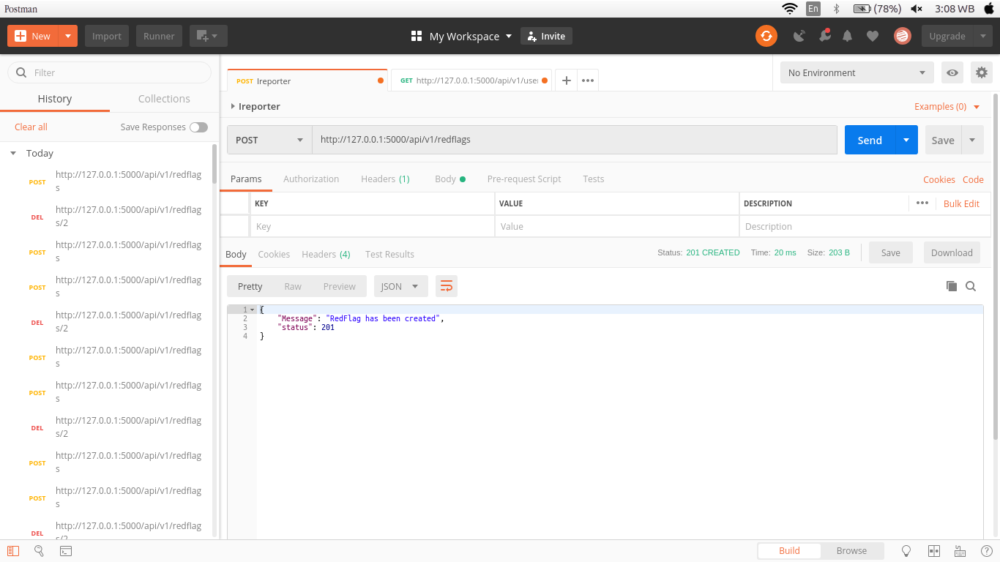
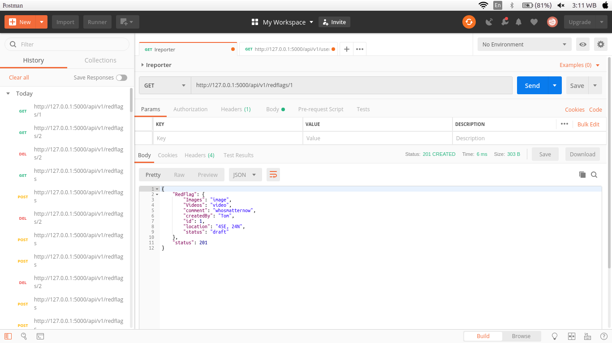
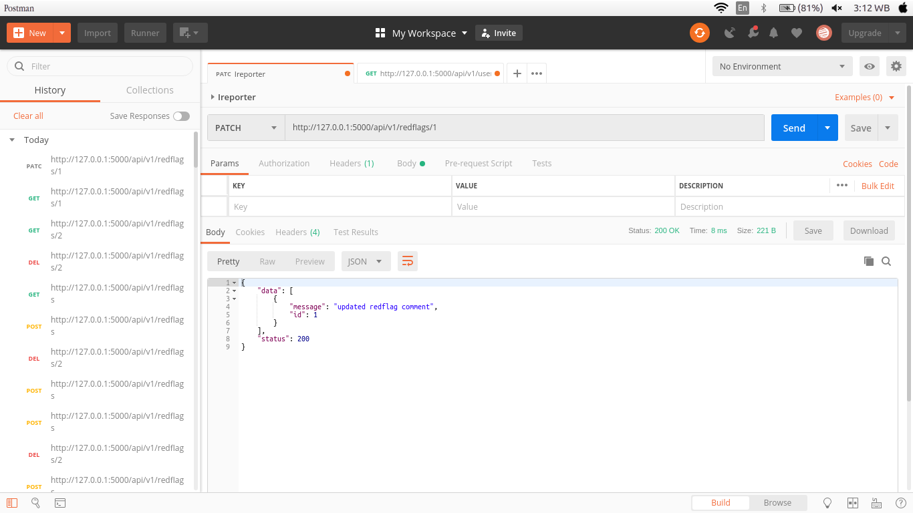

# IReporter [](https://travis-ci.org/tomkeith/IReporter)  [](https://codecov.io/gh/tomkeith/IReporter)


```
https://tomkeith.github.io/IReporter/
```

# IReporter
```
Corruption is a huge bane to Africa’s development. African countries must develop novel and localised solutions that will curb this menace, hence the birth of iReporter. iReporter enables any/every citizen to bring any form of corruption to the notice of appropriate authorities and the general public. Users can also report on things that needs government intervention
```

## Getting Started
```
These instructions will get you a copy of the project up and running on your local machine for development and testing purposes. See deployment for notes on how to deploy the project on a live system.
```

### Prerequisites


# Technology Used:
* **Python3**
* **Flask**
* **Flask-RESTful**

# [Pivotal Tracker](https://www.pivotaltracker.com/n/projects/2227030)

## Current Endpoints.

| Method | Route | Endpoint Function |
| :--- | :--- | :--- |
| Post | api/v1/redflags | Creates a RedFlag |
| Get | api/v1/redflags | Gets all RedFlags |
| Get | api/v1/redflags/id | Gets a specific RedFlag |
| Patch | api/v1/redflags/id | Edit a specific RedFlag |
| Delete | api/v1/redflags/id | Delete a specific RedFlag |


## Installastion Guide.
#### Clone the repo.
```
$ https://github.com/tomkeith/IReporter.git

```
#### Create a Virtual Environment and Activate.
```
$ python3 -m venv env
$ source env/bin/activate
```
#### Install Dependencies.
```
(venv) $ pip install -r requirements.txt
```
#### Run the app
```
(venv) $ FLASK_APP=run.py
(venv) $ flask run
```
The app should be accessible through : http://127.0.0.1:5000/


## Session Examples
To follow along with this examples get postman app installed.
- Set Up POSTMAN.

- Create RedFlag



- Post data in the format below to the redflag endpoint :
```
/api/v1/redflags
```
```
{
  "createdBy" : "tom",
  "location" : "45E, 24N",
  "status" : "draft", 
  "Images" : "image", 
  "Videos" : "video",
  "comment" : "whosmatternow"
}
```

- Get all RedFlags


- Get data from the redflags endpoint :
```
/api/v1/redflags
```

- Get specific RedFlag




- Get data from the redflags endpoint :
```
/api/v1/redflags/1
```

- Edit specific RedFlag




- Post data in the format below to the redflag endpoint : 
```
/api/v1/redflags/1
```
```
{
  "createdBy" : "tom",
  "location" : "Kayole",
  "status" : "draft", 
  "Images" : "image", 
  "Videos" : "video",
  "comment" : "whosmatternow..."
}
```

- Delete Specific RedFlag


- Delete data from the redflag endpoint :
```
/api/v1/redflags/3
```
#### Run the Tests
```
(venv) $ pytest --cov=app